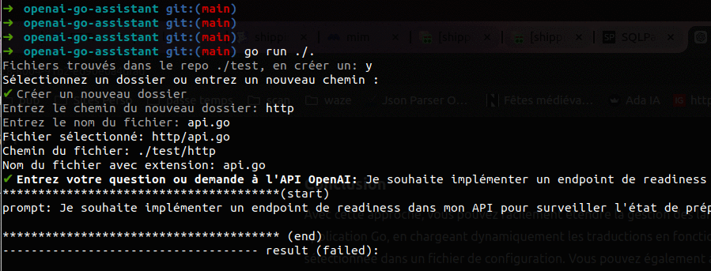
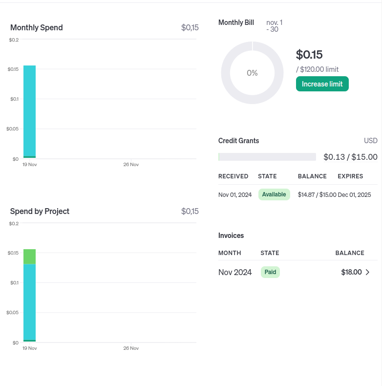

# openai-go-assistant

**OpenAI Go Assistant** is a Go project that allows you to interact with the OpenAI API to automate various code generation and optimization operations. Designed for developers, this wizard makes creating Go code easy by offering advanced features, such as generating code from natural instructions, optimizing existing code, fixing errors, and adding unit tests.



## Features

- **Code generation**: Create Go code from simple natural language instructions by leveraging the power of the OpenAI API. The wizard generates initial code for functions, structures, algorithms, and more.

- **Error Correction**: Analyze code to automatically detect and correct syntax, logic, or optimization errors, making the debugging process faster and more efficient.

- **Code Optimization**: Rewrite and optimize existing code to improve performance, reduce complexity, or adhere to Go programming best practices.

- **Unit test generation**: Generate Go unit tests associated with code to ensure feature coverage and automatically validate expected behavior.

## Requirements

Install goimport tools pour réparer les imports manquant

```shell
go install golang.org/x/tools/cmd/goimports@latest
```

Install staticCheck pour détecter les fonctions non utilisées dans le code généré.

```shell
go install honnef.co/go/tools/cmd/staticcheck@latest
```

## Installation

### 1. Clone the repository

Start by cloning this repository and navigating to the project folder:

```shell
git clone https://github.com/ariden83/openai-go-assistant.git
cd openai-go-assistant
```

### 2. Configure your OpenAI API keys:

Add your OpenAI API keys and configure settings in an **.goia** file located in the **project root** or in your **home directory**.:

```env
language: "fr"
openai_model: "gpt-4-turbo"
openai_api_key: "your-api-key"
openai_url: "https://api.openai.com/v1/chat/completions"
openai_temperature: 0.6
openai_max_tokens: 256
max_attempts: 3
```

### 3. Install the dependencies

#### a) Necessary tools

**Goimports**: Automatically repairs missing imports in code.

```shell
go install golang.org/x/tools/cmd/goimports@latest
```

**Staticcheck**: Detects unused functions and other problems in the code.

```shell
go install honnef.co/go/tools/cmd/staticcheck@latest
```

### 4. Use

You have two options to run the project: install the utility or launch the project directly from the command line.

#### **Option 1**: Install the utility

Build and install the binary using the following command:

```shell
make install
```

Once installed, you will be able to run the wizard via specific commands to take advantage of its different features.

####  **Option 2**: Launch the project directly

If you prefer to run the project without installing the utility, simply run:

```shell
go run ./...
```

## Usage

```text
Usage: goia [flags] [path ...]
  -d	display diffs instead of rewriting files
  -l	list files whose formatting differs from goimport's
  -local string
    	put imports beginning with this string after 3rd-party package
  -prefix value
    	relative local prefix to from a new import group (can be given several times)
  -w	write result to (source) file instead of stdout
```

**Example :**

```shell
goia -l -w ./test/.
```


## OpenAI usage cost

You can then track API usage costs in real time on the OpenAI platform [OpenAI usage cost](https://platform.openai.com/settings/organization/usage).




## Resources

- [Models OpenAI API](https://platform.openai.com/docs/models)
- [OpenAI API](https://platform.openai.com/docs/api-reference)
- [OpenAI usage cost](https://platform.openai.com/settings/organization/usage)
- [OpenAI playground - test models](https://platform.openai.com/playground/chat?models=gpt-4o)

## Contribution

Contributions are welcome! If you want to improve OpenAI Go Assistant, feel free to open an issue or submit a pull request.

## Licence

This project is under the MIT license.
